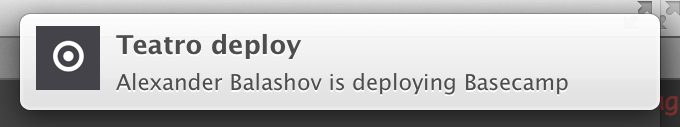

# PLEASE NOTE, THIS PROJECT IS NO LONGER BEING MAINTAINED
# Capistrano::TeamNotifications

[](https://codeclimate.com/github/evrone/capistrano-team_notifications)

This gem sends notifications for all team members via [Space notifications](https://space-notice.com/) 
and OSX Notification Center.

<a href="https://evrone.com/?utm_source=github.com">
  
</a>

## Demo



## Getting Started
### Prerequisites

What things you need to install the software and how to install them

```
Give examples
```

### Installation

Add this line to your application's Gemfile:

    gem 'capistrano-team_notifications', group: [:development]

or if you use Capistrano v2

    gem 'capistrano-team_notifications', '~> 2'

And then execute:

    $ bundle
    
### Usage

First go to [Space notifications](https://space-notice.com/), create project like 'Facebook deploy' and get project token.

Add to Capfile

```ruby
require 'capistrano/team_notifications'
```

add to deploy.rb file

```ruby
set :team_notifications_token, "HERE_YOUR_SPACE_NOTIFICATIONS_TOKEN"
```

And finally give this link

    https://space-notice.com/auth/github?token=TOKEN

to your team members and ask them to open it in Safari 7 or above.

## Contributing

Please read [Code of Conduct](CODE-OF-CONDUCT.md) and [Contributing Guidelines](CONTRIBUTING.md) 
for submitting pull requests to us.

## Versioning

We use [SemVer](http://semver.org/) for versioning. For the versions available, 
see the [tags on this repository](https://github.com/evrone/capistrano-team_notifications/tags). 

## Authors

* [Alexander Balashov](https://github.com/divineforest) - *Initial work*

See also the list of [contributors](https://github.com/evrone/capistrano-team_notifications/contributors) who participated in this project.

## License

This project is licensed under the [MIT License](LICENSE).
